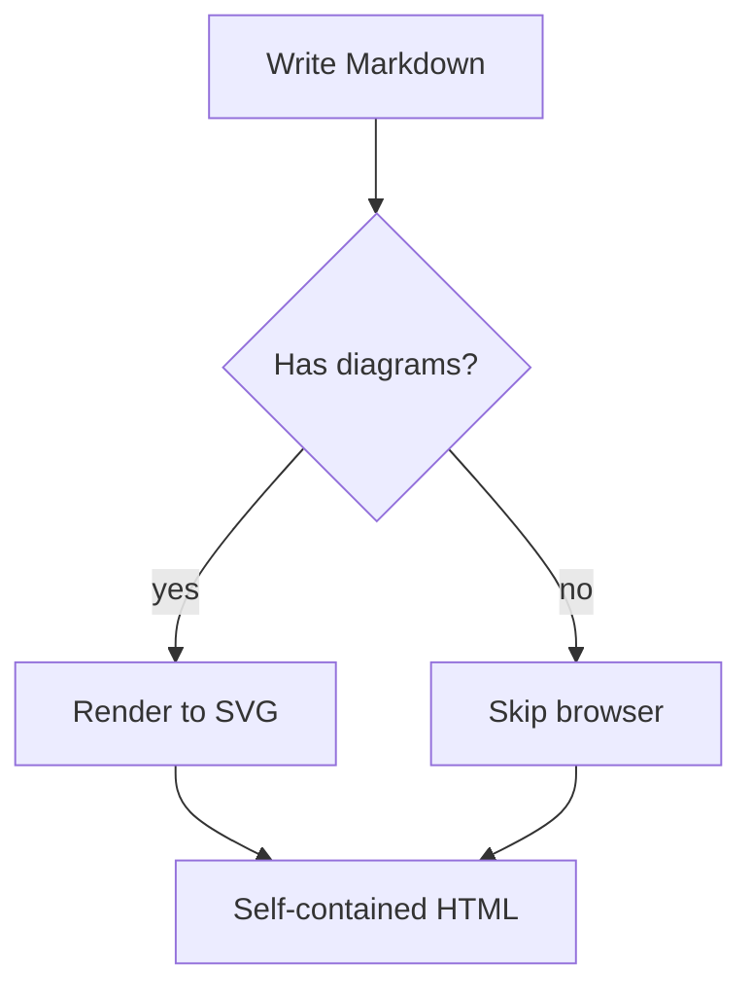
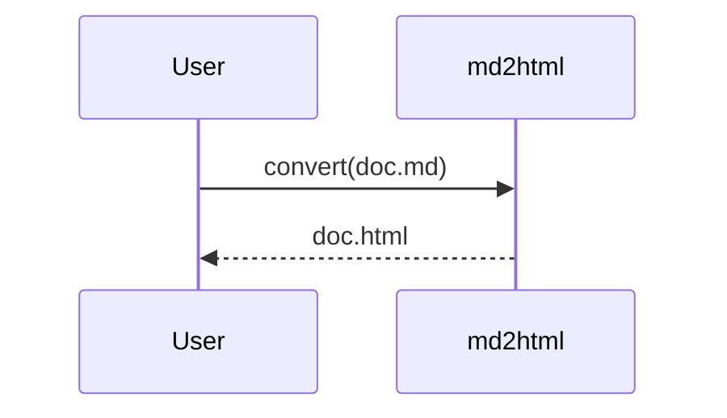

# Diagrams (Mermaid) Implementation Plan

> **For agentic workers:** REQUIRED SUB-SKILL: Use superpowers:subagent-driven-development (recommended) or superpowers:executing-plans to implement this plan task-by-task. Steps use checkbox (`- [ ]`) syntax for tracking.

**Goal:** Render ```mermaid fenced blocks to static inline SVG at build time (headless Chromium), with graceful fallback and zero runtime JS in the output.

**Architecture:** A new `src/mermaid/render.ts` launches headless Chromium (Playwright), loads the Mermaid bundle, and renders each diagram source to SVG. `convert()` collects ```mermaid fence sources, renders them (only when present), and stashes the per-diagram HTML in `env`; a fence-rule wrapper in the renderer emits them, delegating all other fences to Shiki. The theme styles the `<figure class="mermaid">` and declares the diagram color palette in its manifest — the converter only plumbs it.

**Tech Stack:** TypeScript (ESM, strict), `mermaid` (diagram lib), `playwright` (headless Chromium). Probe-confirmed working in this environment.

**Spec:** `docs/superpowers/specs/2026-06-06-diagrams-design.md`

---

## Key facts (verified)

- **Probe result:** headless Chromium launches (~2s), Mermaid 11.15.0's UMD `dist/mermaid.min.js` loads via `page.addScriptTag`, and `mermaid.render(id, src)` returns `<svg…>` (~0.4s/diagram). `getBBox` text measurement works.
- **Browser pin:** the environment caches Chromium build **1208**; `playwright@1.60.0` drives it. Pin `playwright` to `1.60.0`. `npm install playwright@1.60.0` installs only the JS (no auto browser download). If a fresh browser is needed, `npx playwright install chromium`. `renderMermaid` also honors `process.env.MD2HTML_CHROMIUM_PATH` as an `executablePath` override.
- **Mermaid bundle path:** `mermaid` exports `"./*": "./*"`, so `require.resolve('mermaid/package.json')` resolves; the browser bundle is `<dir>/dist/mermaid.min.js`.
- `src/convert.ts` (current): `convert(raw, shikiTheme)`; does `const env = {}; const tokens = md.parse(content, env); const bodyHtml = md.renderer.render(tokens, md.options, env)`; returns `{ metadata, bodyHtml, hasMath, lang, toc }`.
- `src/markdown/renderer.ts` registers `md.use(await Shiki({ theme }))`, which sets `md.renderer.rules.fence`. A ```mermaid fence is a `fence` token with `token.info.trim() === 'mermaid'` and `token.content` = the source.
- `src/themes.ts` `loadTheme` returns a `Theme`; `src/types.ts` defines `Theme`. `src/cli.ts` calls `convert(raw, theme.shikiTheme)`.
- tsup externalizes dependencies, so `playwright`/`mermaid` load from `node_modules` at runtime.
- The kitchen-sink fixture has a code block but NO mermaid; the fence wrapper delegates non-mermaid fences to Shiki unchanged, so the existing snapshot is unaffected until the theme CSS changes (Task 6).

## File structure

- **Create** `src/mermaid/render.ts` — `mermaidFallbackHtml` (pure) + `renderMermaid` (async browser).
- **Modify** `src/markdown/renderer.ts` — fence wrapper intercepting `mermaid`.
- **Modify** `src/convert.ts` — collect sources, render, stash in `env`.
- **Modify** `src/types.ts`, `src/themes.ts` — `Theme.mermaid` config from manifest.
- **Modify** `src/cli.ts` — pass `theme.mermaid` to `convert`.
- **Modify** `themes/claude/theme.json` — warm Mermaid palette.
- **Modify** `themes/claude/theme.css` — `figure.mermaid` + `.mermaid-fallback` styling.
- **Modify** `THEME-CONTRACT.md`.
- **Create** `src/mermaid/render.test.ts` (or `test/mermaid.test.ts`), `samples/diagram.md`; **Modify** `test/convert.test.ts`, `test/themes.test.ts`, snapshot.

---

### Task 1: Dependencies + `mermaidFallbackHtml` (pure)

**Files:** `package.json`; Create `src/mermaid/render.ts`; Create `test/mermaid.test.ts`.

- [ ] **Step 1: Install dependencies**

Run:
```bash
npm install mermaid@^11.15.0 playwright@1.60.0
```
Expected: both added to `"dependencies"`. (This installs JS only; no browser download.)

- [ ] **Step 2: Write the failing test** — Create `test/mermaid.test.ts`:
```ts
import { describe, it, expect } from 'vitest'
import { mermaidFallbackHtml } from '../src/mermaid/render'

describe('mermaidFallbackHtml', () => {
  it('wraps the source in a .mermaid-fallback figure with escaped text', () => {
    const html = mermaidFallbackHtml('graph TD; A --> B & <x>')
    expect(html).toContain('<figure class="mermaid-fallback">')
    expect(html).toContain('A --&gt; B &amp; &lt;x&gt;')
    expect(html).toContain('</figure>')
  })
})
```

- [ ] **Step 3: Run the test to verify it fails** — Run: `npx vitest run test/mermaid.test.ts` → expect FAIL (module missing).

- [ ] **Step 4: Implement the pure helper** — Create `src/mermaid/render.ts`:
```ts
function escapeHtml(s: string): string {
  return s
    .replace(/&/g, '&amp;')
    .replace(/</g, '&lt;')
    .replace(/>/g, '&gt;')
    .replace(/"/g, '&quot;')
}

/**
 * Fallback HTML for a diagram that could not be rendered (no browser, or invalid
 * Mermaid syntax): the source shown as a code block. The theme styles
 * `.mermaid-fallback` (and may add a "not rendered" note).
 */
export function mermaidFallbackHtml(source: string): string {
  return `<figure class="mermaid-fallback"><pre><code>${escapeHtml(source)}</code></pre></figure>`
}
```

- [ ] **Step 5: Run the test to verify it passes** — Run: `npx vitest run test/mermaid.test.ts` → expect PASS.

- [ ] **Step 6: Commit**
```bash
git add package.json package-lock.json src/mermaid/render.ts test/mermaid.test.ts
git commit -m "feat(diagrams): add mermaid/playwright deps + mermaidFallbackHtml"
```

---

### Task 2: `renderMermaid` (headless browser) + gated smoke test

**Files:** Modify `src/mermaid/render.ts`; Modify `test/mermaid.test.ts`.

- [ ] **Step 1: Implement `renderMermaid`** — Add to `src/mermaid/render.ts` (top-of-file node imports + the function). Playwright is imported **dynamically inside the function** so non-diagram conversions never load it (and a missing playwright simply throws → the caller falls back):
```ts
import { createRequire } from 'node:module'
import { dirname, join } from 'node:path'
```
```ts
/**
 * Render each Mermaid source to an inline-SVG `<figure class="mermaid">`. A source
 * with invalid syntax becomes a `.mermaid-fallback` block (per-source). Throws only
 * if the browser cannot launch — the caller then falls back for every diagram.
 *
 * @param config Mermaid init config (theme/themeVariables), supplied by the theme.
 */
export async function renderMermaid(
  sources: string[],
  config: Record<string, unknown> = {},
): Promise<string[]> {
  const require = createRequire(import.meta.url)
  const bundle = join(dirname(require.resolve('mermaid/package.json')), 'dist', 'mermaid.min.js')
  // Lazy import: non-diagram conversions never load Playwright; a missing
  // Playwright throws here and the caller (convert) falls back to source blocks.
  const { chromium } = await import('playwright')
  const ep = process.env.MD2HTML_CHROMIUM_PATH
  const browser = await chromium.launch(ep ? { headless: true, executablePath: ep } : { headless: true })
  try {
    const page = await browser.newPage()
    await page.setContent('<!doctype html><html><body></body></html>')
    await page.addScriptTag({ path: bundle })
    const svgs: Array<string | null> = await page.evaluate(
      async ({ sources, config }) => {
        // mermaid is injected as a window global by addScriptTag
        const mermaid = (window as unknown as { mermaid: any }).mermaid
        mermaid.initialize({ startOnLoad: false, securityLevel: 'strict', ...config })
        const out: Array<string | null> = []
        for (let i = 0; i < sources.length; i++) {
          try {
            const { svg } = await mermaid.render('d' + i, sources[i])
            out.push(svg)
          } catch {
            out.push(null)
          }
        }
        return out
      },
      { sources, config },
    )
    return svgs.map((svg, i) =>
      svg ? `<figure class="mermaid">${svg}</figure>` : mermaidFallbackHtml(sources[i]),
    )
  } finally {
    await browser.close()
  }
}
```

- [ ] **Step 2: Write the gated smoke test** — Append to `test/mermaid.test.ts`:
```ts
import { renderMermaid } from '../src/mermaid/render'

describe('renderMermaid (real browser, gated)', () => {
  it('renders a flowchart to inline SVG, or self-skips if no browser', async (ctx) => {
    let out: string[]
    try {
      out = await renderMermaid(['graph TD; A[Start]-->B[Done];'])
    } catch {
      // Browser could not launch in this environment — skip rather than fail.
      ctx.skip()
      return
    }
    expect(out[0]).toContain('<figure class="mermaid">')
    expect(out[0]).toContain('<svg')
    expect(out[0]).toContain('Start')
  }, 60000)

  it('renders invalid syntax as a fallback (when a browser is available)', async (ctx) => {
    let out: string[]
    try {
      out = await renderMermaid(['graph TD; this is not valid mermaid @@@'])
    } catch {
      ctx.skip()
      return
    }
    expect(out[0]).toContain('class="mermaid-fallback"')
  }, 60000)
})
```

- [ ] **Step 3: Run the test** — Run: `npx vitest run test/mermaid.test.ts` → expect PASS (the smoke tests render if Chromium is available, else self-skip; the `mermaidFallbackHtml` test always passes).

If the smoke tests SKIP, try `npx playwright install chromium` once, then re-run. If they still skip, that is acceptable (the environment lacks a launchable browser) — note it in your report; do NOT make the tests fail.

- [ ] **Step 4: Typecheck** — Run: `npm run typecheck` → expect no errors.

- [ ] **Step 5: Commit**
```bash
git add src/mermaid/render.ts test/mermaid.test.ts
git commit -m "feat(diagrams): renderMermaid — headless-Chromium SVG rendering + gated smoke test"
```

---

### Task 3: Fence interception in the renderer

**Files:** Modify `src/markdown/renderer.ts`; Modify `test/mermaid.test.ts`.

- [ ] **Step 1: Write the failing test** — Append to `test/mermaid.test.ts`:
```ts
import type MarkdownIt from 'markdown-it'
import { createRenderer } from '../src/markdown/renderer'

describe('mermaid fence interception', () => {
  let md: MarkdownIt
  beforeAll(async () => { md = await createRenderer('vitesse-dark') })

  it('emits the pre-rendered diagram from env for a mermaid fence', () => {
    const env = { mermaid: ['<figure class="mermaid">PRE_RENDERED</figure>'], mermaidIndex: 0 }
    const html = md.render('```mermaid\ngraph TD; A-->B;\n```', env)
    expect(html).toContain('<figure class="mermaid">PRE_RENDERED</figure>')
    expect(html).not.toContain('class="shiki"') // not handed to Shiki
  })

  it('falls back to source when env has no rendered diagram', () => {
    const html = md.render('```mermaid\ngraph TD; A-->B;\n```', {})
    expect(html).toContain('class="mermaid-fallback"')
  })

  it('still sends non-mermaid fences to Shiki', () => {
    const html = md.render('```js\nconst x = 1\n```', {})
    expect(html).toContain('class="shiki"')
  })
})
```
Add `beforeAll` to the vitest import at the top of the file if not already present.

- [ ] **Step 2: Run the test to verify it fails** — Run: `npx vitest run test/mermaid.test.ts` → expect FAIL (mermaid fence handled by Shiki, not intercepted).

- [ ] **Step 3: Implement the fence wrapper** — In `src/markdown/renderer.ts`:

(a) Add the import near the others:
```ts
import { mermaidFallbackHtml } from '../mermaid/render'
```
(b) After the `md.use(await Shiki({ theme: shikiTheme as never }))` line, add:
```ts
  // Intercept ```mermaid fences: emit the pre-rendered diagram stashed in env by
  // convert(); everything else goes to Shiki. Keeps async diagram rendering out
  // of the synchronous render pass.
  const shikiFence = md.renderer.rules.fence!
  md.renderer.rules.fence = (tokens, idx, options, env, self) => {
    if (tokens[idx].info.trim() === 'mermaid') {
      const e = env as { mermaid?: string[]; mermaidIndex?: number }
      const i = e.mermaidIndex ?? 0
      e.mermaidIndex = i + 1
      return e.mermaid?.[i] ?? mermaidFallbackHtml(tokens[idx].content)
    }
    return shikiFence(tokens, idx, options, env, self)
  }
```

- [ ] **Step 4: Run the test to verify it passes** — Run: `npx vitest run test/mermaid.test.ts` → expect PASS.

- [ ] **Step 5: Verify no snapshot drift** — Run: `npx vitest run test/snapshot.test.ts` → expect PASS with no change (the kitchen-sink code fence still goes to Shiki). If it fails, STOP and report (do not `-u`).

- [ ] **Step 6: Commit**
```bash
git add src/markdown/renderer.ts test/mermaid.test.ts
git commit -m "feat(diagrams): intercept mermaid fences, delegating others to Shiki"
```

---

### Task 4: `convert()` renders diagrams

**Files:** Modify `src/convert.ts`; Modify `test/convert.test.ts`.

- [ ] **Step 1: Write the failing test** — Append to `test/convert.test.ts`. It mocks the browser renderer so no Chromium is needed (add the `vi` import: `import { describe, it, expect, vi } from 'vitest'` — merge with the existing vitest import):
```ts
vi.mock('../src/mermaid/render', async (importOriginal) => {
  const actual = await importOriginal<typeof import('../src/mermaid/render')>()
  return {
    ...actual,
    renderMermaid: vi.fn(async (sources: string[]) =>
      sources.map((_s, i) => `<figure class="mermaid"><svg>MOCK${i}</svg></figure>`),
    ),
  }
})

describe('convert mermaid diagrams', () => {
  const md = '# T\n\n```mermaid\ngraph TD; A-->B;\n```\n\n```mermaid\nsequenceDiagram\n  A->>B: hi\n```'

  it('renders each mermaid block to a figure (in order)', async () => {
    const { bodyHtml } = await convert(md, 'vitesse-dark')
    expect(bodyHtml).toContain('<figure class="mermaid"><svg>MOCK0</svg></figure>')
    expect(bodyHtml).toContain('<figure class="mermaid"><svg>MOCK1</svg></figure>')
  })

  it('passes the mermaid config through to the renderer', async () => {
    const mod = await import('../src/mermaid/render')
    await convert('```mermaid\ngraph TD; A-->B;\n```', 'vitesse-dark', { theme: 'base' })
    expect(mod.renderMermaid).toHaveBeenCalledWith(expect.any(Array), { theme: 'base' })
  })

  it('falls back for every diagram when the renderer throws (no browser)', async () => {
    const mod = await import('../src/mermaid/render')
    ;(mod.renderMermaid as ReturnType<typeof vi.fn>).mockRejectedValueOnce(new Error('no browser'))
    const { bodyHtml } = await convert('```mermaid\ngraph TD; A-->B;\n```', 'vitesse-dark')
    expect(bodyHtml).toContain('class="mermaid-fallback"')
  })

  it('does not invoke the renderer when there are no diagrams', async () => {
    const mod = await import('../src/mermaid/render')
    ;(mod.renderMermaid as ReturnType<typeof vi.fn>).mockClear()
    await convert('# Just text\n\nNo diagrams here.', 'vitesse-dark')
    expect(mod.renderMermaid).not.toHaveBeenCalled()
  })
})
```

- [ ] **Step 2: Run the test to verify it fails** — Run: `npx vitest run test/convert.test.ts` → expect FAIL (diagrams not rendered; renderer never called).

- [ ] **Step 3: Implement** — In `src/convert.ts`:

(a) Add the import after the existing imports:
```ts
import { renderMermaid, mermaidFallbackHtml } from './mermaid/render'
```
(b) Widen the signature — change:
```ts
export async function convert(raw: string, shikiTheme: ShikiTheme): Promise<ConvertResult> {
```
to:
```ts
export async function convert(
  raw: string,
  shikiTheme: ShikiTheme,
  mermaidConfig: Record<string, unknown> = {},
): Promise<ConvertResult> {
```
(c) After `const tokens = md.parse(content, env)` and BEFORE `const bodyHtml = md.renderer.render(...)`, insert the diagram rendering:
```ts
  // Collect ```mermaid sources (in document order) and render them to SVG before
  // the synchronous render pass. Only launches a browser when diagrams exist.
  const mermaidSources = tokens
    .filter((t) => t.type === 'fence' && t.info.trim() === 'mermaid')
    .map((t) => t.content)
  if (mermaidSources.length > 0) {
    try {
      env.mermaid = await renderMermaid(mermaidSources, mermaidConfig)
    } catch {
      // Browser unavailable — fall back to source blocks for every diagram.
      env.mermaid = mermaidSources.map((s) => mermaidFallbackHtml(s))
    }
    env.mermaidIndex = 0
  }
```
Note: `env` is currently typed `Record<string, unknown>`, so `env.mermaid`/`env.mermaidIndex` assignments are fine.

- [ ] **Step 4: Run the test to verify it passes** — Run: `npx vitest run test/convert.test.ts` → expect PASS.

- [ ] **Step 5: Run the full suite + typecheck** — Run: `npm test && npm run typecheck` → expect all pass (the real-browser smoke tests in test/mermaid.test.ts may skip; that's fine).

- [ ] **Step 6: Commit**
```bash
git add src/convert.ts test/convert.test.ts
git commit -m "feat(diagrams): convert() renders mermaid blocks (browser, with fallback)"
```

---

### Task 5: Theme manifest Mermaid config + CLI plumbing

**Files:** Modify `src/types.ts`, `src/themes.ts`, `src/cli.ts`, `themes/claude/theme.json`; Modify `test/themes.test.ts`.

- [ ] **Step 1: Write the failing test** — Append to `test/themes.test.ts` (inside its existing `describe`):
```ts
  it('loads the claude theme mermaid config from the manifest', () => {
    const theme = loadTheme('claude')
    expect(theme.mermaid).toBeTypeOf('object')
    expect((theme.mermaid as Record<string, unknown>).themeVariables).toBeTypeOf('object')
  })
```

- [ ] **Step 2: Run the test to verify it fails** — Run: `npx vitest run test/themes.test.ts` → expect FAIL (`theme.mermaid` undefined).

- [ ] **Step 3: Implement**

(a) In `src/types.ts`, add to the `Theme` interface:
```ts
  /** Optional Mermaid init config (theme/themeVariables) for diagram colors. */
  mermaid?: Record<string, unknown>
```
(b) In `src/themes.ts` `loadTheme`, add `mermaid` to the returned object (read from the manifest), e.g. alongside the other fields:
```ts
    mermaid: manifest.mermaid,
```
(c) In `themes/claude/theme.json`, add a warm Mermaid palette (a top-level `"mermaid"` key):
```json
  "mermaid": {
    "theme": "base",
    "themeVariables": {
      "fontFamily": "Georgia, 'Iowan Old Style', serif",
      "primaryColor": "#f3ede1",
      "primaryTextColor": "#2b2a26",
      "primaryBorderColor": "#cc785c",
      "secondaryColor": "#eef1e4",
      "tertiaryColor": "#faf9f5",
      "lineColor": "#a64f34",
      "textColor": "#2b2a26",
      "mainBkg": "#f3ede1",
      "nodeBorder": "#cc785c",
      "clusterBkg": "#faf9f5",
      "clusterBorder": "#e7e0d2",
      "noteBkgColor": "#f7efda",
      "noteTextColor": "#2b2a26"
    }
  }
```
(d) In `src/cli.ts`, pass the config — change `const { metadata, bodyHtml, hasMath, lang, toc } = await convert(raw, theme.shikiTheme)` to also pass the third arg:
```ts
  const { metadata, bodyHtml, hasMath, lang, toc } = await convert(raw, theme.shikiTheme, theme.mermaid ?? {})
```

- [ ] **Step 4: Run the test + full suite + typecheck** — Run: `npx vitest run test/themes.test.ts && npm test && npm run typecheck` → expect all pass.

- [ ] **Step 5: Commit**
```bash
git add src/types.ts src/themes.ts src/cli.ts themes/claude/theme.json test/themes.test.ts
git commit -m "feat(diagrams): theme-declared Mermaid palette plumbed through to render"
```

---

### Task 6: Claude theme styling + sample + snapshot

**Files:** Modify `themes/claude/theme.css`; Create `samples/diagram.md`; Modify `test/__snapshots__/snapshot.test.ts.snap`.

**Architectural guardrail:** CSS only in `themes/claude/theme.css`, all selectors `.theme-claude`-prefixed.

- [ ] **Step 1: Append the diagram styles at the END of `themes/claude/theme.css`:**
```css

/* Diagrams (Mermaid). The converter emits <figure class="mermaid"> with inline
   SVG (colors come from the theme's mermaid manifest config), or a
   <figure class="mermaid-fallback"> source block when rendering isn't possible. */
.theme-claude figure.mermaid,
.theme-claude figure.mermaid-fallback {
  margin: 1.8rem 0;
  text-align: center;
  overflow-x: auto;
}
.theme-claude figure.mermaid svg { max-width: 100%; height: auto; }
.theme-claude figure.mermaid-fallback {
  text-align: left;
}
.theme-claude figure.mermaid-fallback pre {
  margin: 0;
  padding: 1.15rem 1.35rem;
  border-radius: 10px;
  border: 1px dashed var(--rule);
  background: var(--tint);
  overflow-x: auto;
  font-size: 0.84rem;
}
.theme-claude figure.mermaid-fallback::after {
  content: "Diagram not rendered — showing source.";
  display: block;
  margin-top: 0.4rem;
  font-size: 0.8rem;
  color: var(--muted);
}
```

- [ ] **Step 2: Create the sample** — Create `samples/diagram.md`:
````markdown
---
title: Diagram showcase
---

A flowchart:



A sequence diagram:


````

- [ ] **Step 3: Build and render the sample** — Run:
```bash
npm run build && node dist/cli.js samples/diagram.md
grep -c 'class="mermaid"' samples/diagram.html
grep -c '<svg' samples/diagram.html
```
Expected (if a browser is available): both ≥ 1 — diagrams rendered to inline SVG. If `<svg` count is 0 you'll instead see `class="mermaid-fallback"` (no browser) — in that case run `npx playwright install chromium` and rebuild; if it still falls back, note it for the controller (the fallback rendering is itself correct).

- [ ] **Step 4: Regenerate the kitchen-sink snapshot** (theme.css changed; kitchen-sink has no diagrams, so only the CSS inside `<style>` changes) — Run:
```bash
npx vitest run test/snapshot.test.ts -u
```
Then `git diff test/__snapshots__/snapshot.test.ts.snap` and confirm the ONLY change is the appended diagram CSS inside the `<style>` block (no `<figure>`/`<svg>` in the body, since the fixture has no mermaid). If anything else changed, STOP and report.

- [ ] **Step 5: Run the full suite + typecheck** — Run: `npm test && npm run typecheck` → expect all pass.

- [ ] **Step 6: Commit**
```bash
git add themes/claude/theme.css samples/diagram.md test/__snapshots__/snapshot.test.ts.snap
git commit -m "feat(diagrams): Claude theme styling for mermaid figures + sample"
```

---

### Task 7: Theme contract note

**Files:** Modify `THEME-CONTRACT.md`.

- [ ] **Step 1: Document the hooks.** In `THEME-CONTRACT.md`, under `## Element hooks`, add a bullet:
```markdown
- Diagrams (Mermaid): a rendered diagram is `<figure class="mermaid">` containing inline `<svg>`; when rendering isn't possible (no browser / invalid syntax) it degrades to `<figure class="mermaid-fallback">` wrapping the source. Diagram colors come from the theme manifest's optional `mermaid` config (a Mermaid init object with `theme`/`themeVariables`), the way the code palette comes from `shikiThemeFile` — the converter only plumbs it.
```

- [ ] **Step 2: Document the manifest field.** In `THEME-CONTRACT.md`, in the `## theme.json` section, add after the code-theme description:
```markdown
A theme may also declare an optional `mermaid` object (a Mermaid init config:
`theme`/`themeVariables`) so diagrams match the theme's palette.
```

- [ ] **Step 3: Commit**
```bash
git add THEME-CONTRACT.md
git commit -m "docs(diagrams): document mermaid figure hooks + manifest config"
```

---

## Final verification (after all tasks)

- [ ] `npm test` — all suites pass (real-browser smoke tests render or self-skip).
- [ ] `npm run typecheck` — clean.
- [ ] `npm run build && node dist/cli.js samples/diagram.md` then open `samples/diagram.html` — diagrams render as inline SVG in the warm palette, centered, readable; wide diagrams scroll. (Controller visual check. If the environment can't launch a browser, confirm the fallback source blocks render cleanly instead.)
- [ ] Confirm a non-diagram document never launches a browser (no slowdown) and is unchanged.
