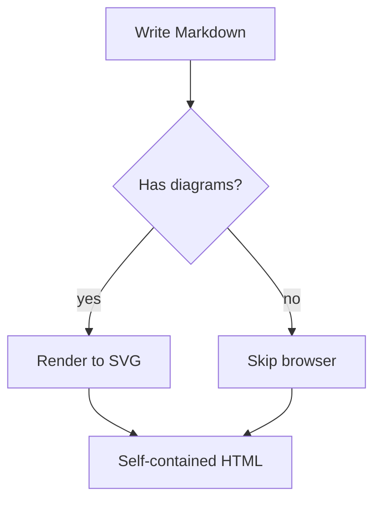
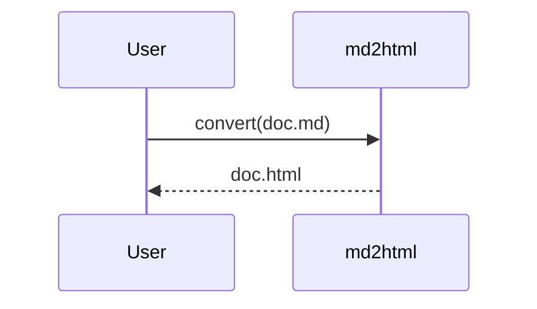

A flowchart:

```mermaid
graph TD
  A[Write Markdown] --> B{Has diagrams?}
  B -->|yes| C[Render to SVG]
  B -->|no| D[Skip browser]
  C --> E[Self-contained HTML]
  D --> E
```

A sequence diagram:

```mermaid
sequenceDiagram
  participant U as User
  participant M as md2html
  U->>M: convert(doc.md)
  M-->>U: doc.html
```
